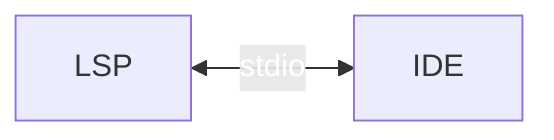
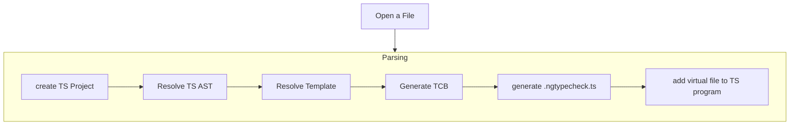
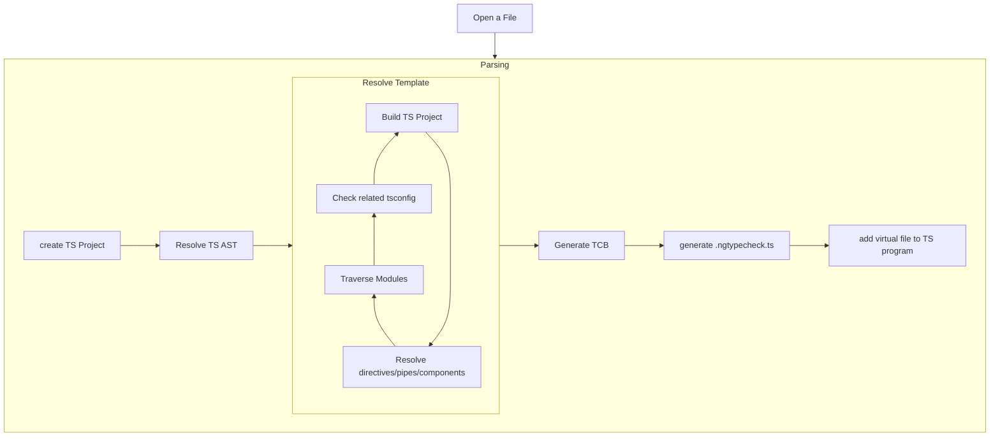
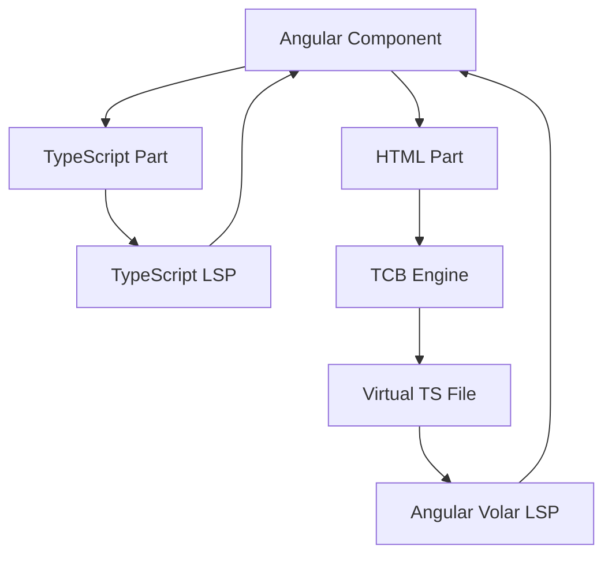

<h1 style="color: transparent; background: url('/angular-gradient.jpg'); background-size: cover; background-position: center; background-clip: text; clip-path: inset(0%);">
    The Angular Language Server
</h1>
<h2>Inside Out</h2> 

---
---

# What is an Language Server

<div class="w-full h-90 flex items-center justify-center">

</div>

---
layout: center
---


---
---

# Angular Language Server - Architecture

<div class="flex items-center justify-center w-full h-90">
```mermaid{scale:1.3}
graph LR
A[Client] --> B
subgraph B [Angular Language Server]
    direction TB
    C[Language Server]-->D[TypeScript Host]
end
B --> E[@angular/language-service]
```
</div>

---
layout: center
---

# Language Server !== Language Service


---
---

# LSP Message Format

````md magic-move
```json{*|2|3|4|6-8|9-12}
{
  "jsonrpc": "2.0",
  "id": 1,
  "method": "textDocument/completion",
  "params": {
    "textDocument": {
      "uri": "file:///path/to/file.txt"
    },
    "position": {
      "line": 10,
      "character": 5
    }
  }
}
```
```json{*|3|7-12}
{
  "jsonrpc": "2.0",
  "id": 1,
  "result": {
    "isIncomplete": false,
    "items": [
      {
        "label": "print",
        "kind": 3, // Function
        "detail": "print(value: any): void",
        "documentation": "Prints a value to the console."
      },
      {
        "label": "println",
        "kind": 3, // Function
        "detail": "println(value: any): void",
        "documentation": "Prints a value to the console and adds a new line."
      }
      // ... more items ...
    ]
  }
}
```
````

---
---

```ts
export class Session {
    private addProtocolHandlers(conn: lsp.Connection) {
        conn.onInitialize(p => this.onInitialize(p));
        conn.onDidOpenTextDocument(p => this.onDidOpenTextDocument(p));
        conn.onDidCloseTextDocument(p => this.onDidCloseTextDocument(p));
        conn.onDidChangeTextDocument(p => this.onDidChangeTextDocument(p));
        conn.onDidSaveTextDocument(p => this.onDidSaveTextDocument(p));
        conn.onDefinition(p => this.onDefinition(p));
        conn.onTypeDefinition(p => this.onTypeDefinition(p));
        conn.onReferences(p => this.onReferences(p));
        conn.onRenameRequest(p => this.onRenameRequest(p));
        conn.onPrepareRename(p => this.onPrepareRename(p));
        conn.onHover(p => this.onHover(p));
        conn.onFoldingRanges(p => this.onFoldingRanges(p));
        conn.onCompletion(p => this.onCompletion(p));
        conn.onCompletionResolve(p => this.onCompletionResolve(p));
        conn.onRequest(GetComponentsWithTemplateFile, p => this.onGetComponentsWithTemplateFile(p));
        conn.onRequest(GetTemplateLocationForComponent, p => this.onGetTemplateLocationForComponent(p));
        conn.onRequest(GetTcbRequest, p => this.onGetTcb(p));
        conn.onRequest(IsInAngularProject, p => this.isInAngularProject(p));
        conn.onCodeLens(p => this.onCodeLens(p));
        conn.onCodeLensResolve(p => this.onCodeLensResolve(p));
        conn.onSignatureHelp(p => this.onSignatureHelp(p));
        conn.onCodeAction(p => this.onCodeAction(p));
        conn.onCodeActionResolve(async p => await this.onCodeActionResolve(p));
    }
}
```

---
layout: image
image: /syntax-highlting.png
backgroundSize: contain
---


---
layout: cover
transition: view-transition
---

<h1 style="view-transition-name: headline; color: transparent; background: url('/angular-gradient.jpg'); background-size: cover; background-position: center; background-clip: text; clip-path: inset(0%);">
    The Angular Language Server
</h1>
<h2>Inside Out</h2> 

---
layout: cover
transition: view-transition
---

<h1 style="view-transition-name: headline; color: transparent; background: url('/angular-gradient.jpg'); background-size: cover; background-position: center; background-clip: text; clip-path: inset(0%);">
    The Angular Language Service
</h1>
<h2>Inside Out</h2> 


---
layout: introduction
---

---
---

# Angular Language Server - Architecture

<div class="flex items-center justify-center w-full h-90">
```mermaid{scale:1.3}
graph LR
A[Client] --> B
subgraph B [Angular Language Server]
    direction TB
    C[Language Server]-->D[TypeScript Host]
end
B --> E[@angular/language-service]
```
</div>

---
layout: image
image: /language-service-npm.png
---


---
---

<div v-click="[1, 2]" class='text-8xl absolute z-5' style="color: var(--onu-colors-blue600); right: 500px; top: 120px">
    <mdi:arrow-left v-motion v-motion-roll-visible-right/> 
    <span class="text-4xl absolute" style="top: 35px">TypeScript</span>
</div>

<div v-click="2" class='text-8xl absolute z-5' style="color: var(--onu-colors-blue700); right: 300px; top: 40px">
    <mdi:arrow-left v-motion v-motion-roll-visible-right/> 
    <span class="text-4xl absolute" style="top: 35px;  text-wrap: nowrap">TypeScript-ish</span>
</div>

```angular-ts{*|8|3}
@Component({
    template: `
        <button (click)="click()">Click Me</button>
    `
})
export class Component{
    constructor(){
        this.click()
    }
    
    public click(){
        // something happens
    }
}
```

---
---

# Angular Language Service - Architecture

<div class="flex items-center justify-center w-full h-90">
```mermaid{scale:1.3}
graph LR
A[Client] --> B
subgraph B [Angular Language Server]
    direction TB
    C[Language Server]-->D[TypeScript Host]
end
B --> E
subgraph E[@angular/language-service]
F[@angular/compiler] ~~~ G[TCB]
end
```
</div>

---
layout: cover
transition: view-transition
---

<h1 style="view-transition-name:headline-1"> T </h1><h1 style="view-transition-name:headline-2"> C </h1><h1 style="view-transition-name:headline-3"> B </h1>

<style>
h1 {
display: contents;
}
</style>

---
layout: cover
transition: view-transition
---

<h1 style="view-transition-name:headline-1"> Type </h1><h1 style="view-transition-name:headline-2"> Check </h1><h1 style="view-transition-name:headline-3"> Block </h1>

<style>
h1 {
display: contents;
}
</style>
---



---
---



---
layout: image
image: /ts-project.png
backgroundSize: contain
---


---
layout: center
---

# Demo Time

---
layout: two-cols
---

<div class="p-2">
<h1>Actual File</h1>

````md magic-move
```angular-ts
@Component({
  selector: 'test',
  template: `<span>{{ variable }}</span>`,
  standalone: true,
})
export class TestComponent {
  public variable = 1;
}
```

```angular-ts
@Component({
  selector: 'test',
  template: `
    <button (click)="someFn()"></button>`,
  standalone: true,
})
export class SomeComponent {
  public variable = 1;

  someFn() {
    console.log('Hello NG DE');
  }
}

```
````
</div>

::right::

<div class="p-2">
<h1>Virtual File</h1>

````md magic-move
```ts
function _tcb1(this: SomeComponent) {
  var _t1 = document.createElement("span");
'  "" + this.variable;
}
```

```ts{*|3|5}
function _tcb1(this: SomeComponent) {
    var _t1 = document.createElement("button");
    _t1.addEventListener("click", 
    ($event): any => {
        this.someFn();
    });
    "" + this.variable;
}
```
````
</div>

<style scoped>
.slidev-layout {
    padding-left: 0.2em !important;
    padding-right: 0.2em !important;
}
</style>

---
layout: two-cols
---

<div class="p-2">
<h1>Actual File</h1>
````md magic-move
```angular-ts
@Component({
  selector: 'test',
  template: `
    <button (click)="someFn('123')"></button>`,
  standalone: true,
})
export class SomeComponent {
  public variable = 1;

  someFn(num: number) {
    console.log('Hello NG DE');
  }
}
```
````
</div>

::right::

<div class="p-2">
<h1>Virtual File</h1>
````md magic-move
```ts{*|5}
function _tcb1(this: SomeComponent) {
    var _t1 = document.createElement("button");
    _t1.addEventListener("click", 
    ($event): any => {
        this.someFn('123');
    });
    "" + this.variable;
}
```
````
</div>

<style scoped>
.slidev-layout {
    padding-left: 0.2em !important;
    padding-right: 0.2em !important;
}
</style>


---
---

```ts
  require(initialPath: string, moduleName: string): ts.server.RequireResult {
    if (moduleName !== '@angular/language-service') {
        return {
            module: undefined,
            error: new Error(`Angular server will not load plugin '${moduleName}'.`),
        };
    }
    ...
}
```

---
layout: cover
transition: view-transitions
---

<h1 style="view-transition-name=headline"> Angular Language Server does not support Plugins </h1>

---
layout: cover
transition: view-transitions
---

<h1 style="view-transition-name=headline"> Angular Language Server does not support Plugins (yet?!)</h1>

---
layout: cover
---

# But why is WebStorm not using the Angular Language Service?!

---
layout: image
image: /vite-conf-talk.png
---

---
layout: center
---

<div class="flex items-center justify-center w-full h-90">

</div>

---
layout: outro
url: https://wordman.dev/talk/2024/ng-de
---
